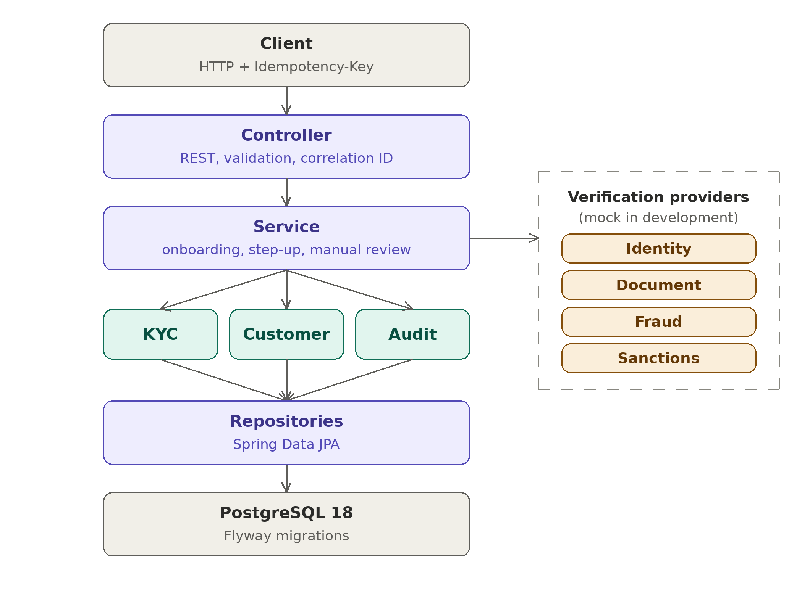
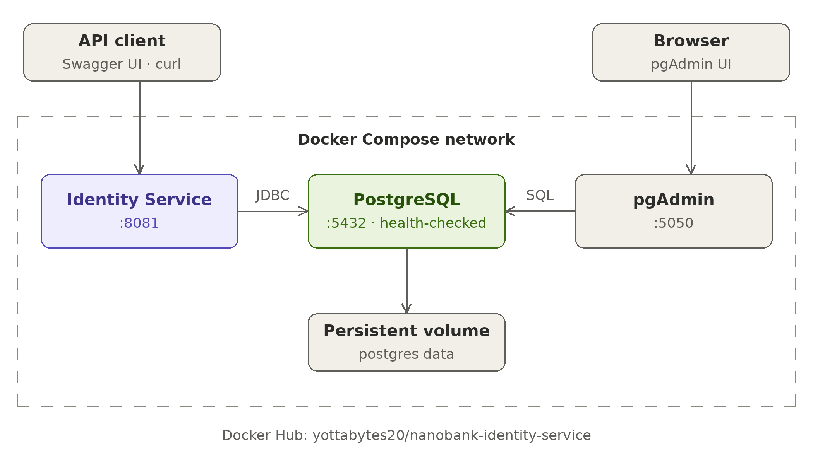
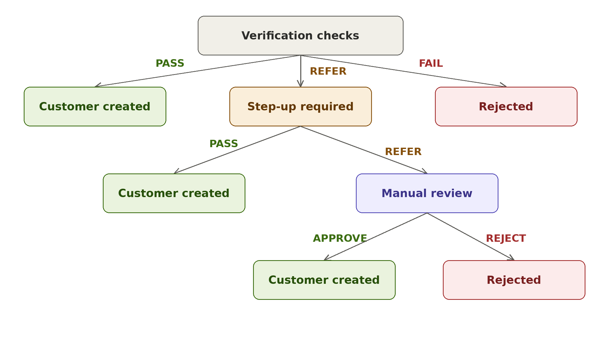
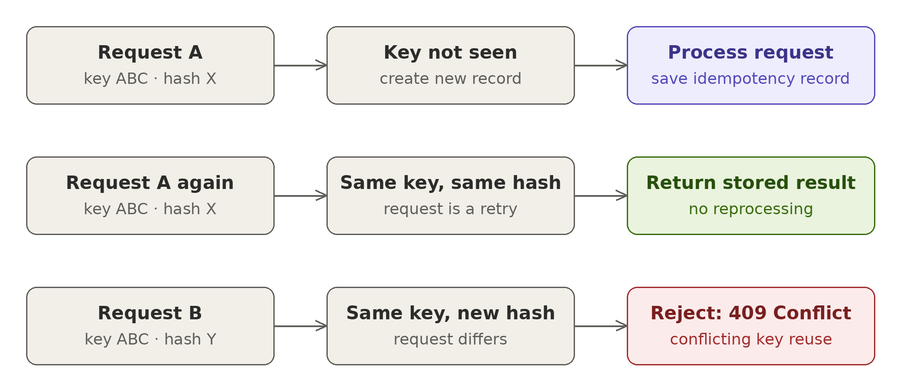
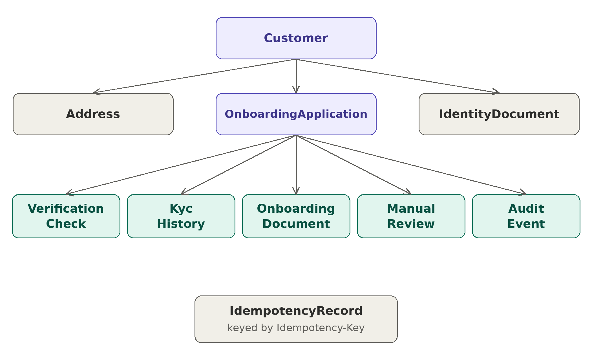
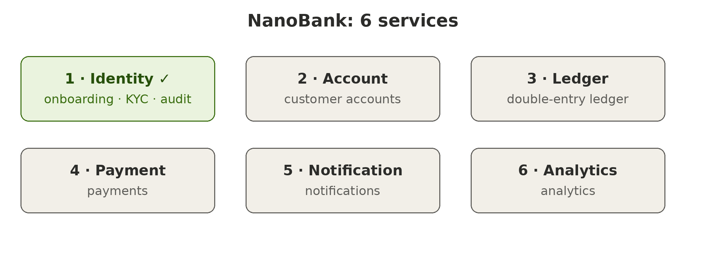

# NanoBank Identity Service

The **NanoBank Identity Service** is the identity and customer-onboarding service for NanoBank, a realistic digital banking platform built with Java and Spring Boot.

The service handles customer onboarding, identity verification, KYC state management, step-up verification, manual review, audit events, idempotent requests, and persistent customer/address data.

The implementation focuses on **financial-system correctness, transactional integrity, testability, and production-oriented backend engineering**.



Docker Hub: [yottabytes20/nanobank-identity-service](https://hub.docker.com/r/yottabytes20/nanobank-identity-service)

---

## Quick Start

### Requirements

* Java 21
* Docker
* Docker Compose
* Git

The project uses the Maven Wrapper, so Maven does not need to be installed globally.

### 1. Clone the repository

```bash
git clone https://github.com/yottabyte-java/nanobank.git
cd nanobank
```

### 2. Configure environment variables

Copy the example environment file.

Linux/macOS:

```bash
cp .env.example .env
```

Windows CMD:

```cmd
copy .env.example .env
```

Open `.env` and fill in every value, for example:

```env
DB_PASSWORD=your-password
PGADMIN_EMAIL=admin@example.com
PGADMIN_PASSWORD=admin123
```

> The file must be named exactly `.env` (not `.env.txt`) and sit next to `docker-compose.yaml`.
>
> If `DB_PASSWORD` is empty, PostgreSQL refuses to start. Check what Compose reads with `docker compose config`.

### 3. Build the application JAR

The Docker image copies the JAR from `target/`, so build it before starting the Compose stack.

Linux/macOS:

```bash
./mvnw clean package -DskipTests
```

Windows CMD:

```cmd
mvnw.cmd clean package -DskipTests
```

### 4. Start the Docker Compose stack

```bash
docker compose up -d --build
```

The stack contains:

* NanoBank Identity Service (`8081`)
* PostgreSQL (`5432`)
* pgAdmin (`5050`)



### 5. Verify the service

Wait about 30 seconds for Spring Boot and Flyway to finish starting, then open:

```text
http://localhost:8081/actuator/health
```

Expected:

```json
{
  "groups": [
    "liveness",
    "readiness"
  ],
  "status": "UP"
}
```

Swagger UI:

```text
http://localhost:8081/swagger-ui/index.html
```

pgAdmin:

```text
http://localhost:5050
```

### 6. Stop the stack

```bash
docker compose down
```

To remove the PostgreSQL volume as well:

```bash
docker compose down -v
```

---

## Run the Published Docker Image

The published image is available on Docker Hub:

https://hub.docker.com/r/yottabytes20/nanobank-identity-service

To run the image without building it locally:

```bash
docker network create nanobank
```

Start PostgreSQL:

```bash
docker run -d --name nanobank-postgres --network nanobank \
  -e POSTGRES_DB=nanobank_identity \
  -e POSTGRES_PASSWORD=change-me \
  postgres:18
```

Start the Identity Service:

```bash
docker run -d --name nanobank-identity --network nanobank -p 8081:8081 \
  -e DB_URL=jdbc:postgresql://nanobank-postgres:5432/nanobank_identity \
  -e DB_USERNAME=postgres \
  -e DB_PASSWORD=change-me \
  yottabytes20/nanobank-identity-service:latest
```

Then check:

```text
http://localhost:8081/actuator/health
```

---

## Troubleshooting

| Problem                                                        | Cause and fix                                                                                                                    |
| -------------------------------------------------------------- | -------------------------------------------------------------------------------------------------------------------------------- |
| PostgreSQL exits with `superuser password is not specified`    | `.env` is missing, misnamed or has an empty `DB_PASSWORD`. Create it from `.env.example` and check with `docker compose config`. |
| Docker build fails with `target/...jar not found`              | The JAR has not been built yet. Run the build step before `docker compose up --build`.                                           |
| `curl: (52) Empty reply from server` immediately after startup | Spring Boot is still starting. Wait about 30 seconds and retry.                                                                  |
| Integration tests fail to start                                | Make sure Docker is running.                                                                                                     |

---

## Build From Source

The project uses the Maven Wrapper.

### Windows

```cmd
mvnw.cmd clean package
```

### Linux / macOS

```bash
./mvnw clean package
```

The generated JAR is located under:

```text
target/
```

---

## Testing

Docker must be running because the integration tests start a real PostgreSQL container using Testcontainers.

### Windows

```cmd
mvnw.cmd clean test
```

### Linux / macOS

```bash
./mvnw clean test
```

Current verified result:

```text
Tests run: 41
Failures: 0
Errors: 0
Skipped: 0

BUILD SUCCESS
```

The test suite covers unit tests, service behaviour, database integration, transaction rollback, onboarding flows, and PostgreSQL integration through Testcontainers.

---

## What the Service Does

The Identity Service manages the customer onboarding lifecycle.



| Verification result | What happens                                                                                                            |
| ------------------- | ----------------------------------------------------------------------------------------------------------------------- |
| PASS                | KYC accepted, customer and address created                                                                              |
| FAIL                | KYC rejected, application rejected                                                                                      |
| REFER               | Step-up verification. Step-up PASS creates the customer; step-up REFER goes to manual review, which approves or rejects |

The service supports:

* Customer onboarding
* Identity verification using mock providers
* Automated PASS / FAIL / REFER outcomes
* Step-up verification
* Manual review
* KYC status history
* Address persistence
* Document metadata
* Audit events
* Idempotent onboarding requests
* Request hashing
* Correlation IDs
* Transactional persistence
* Duplicate identity detection

---

# API

## Start Onboarding

```http
POST /api/v1/onboarding
```

Required header:

```http
Idempotency-Key: test-001
```

Optional header:

```http
X-Correlation-ID: <correlation-id>
```

Example request:

```json
{
  "firstName": "Thabo",
  "lastName": "Mokoena",
  "email": "thabo.mokoena@example.com",
  "mobileNumber": "0821234567",
  "nationalId": "9001015009087",
  "dateOfBirth": "1990-01-01",
  "addressLine1": "12 Church Street",
  "addressLine2": "",
  "city": "Polokwane",
  "province": "Limpopo",
  "postalCode": "0699"
}
```

Save it as `body.json` and send it:

```bash
curl -i -X POST http://localhost:8081/api/v1/onboarding \
  -H "Content-Type: application/json" \
  -H "Idempotency-Key: test-001" \
  -d @body.json
```

Example response:

```json
{
  "applicationId": "uuid",
  "applicationReference": "NB-XXXXXXXX",
  "status": "CUSTOMER_CREATED",
  "currentStep": "COMPLETED",
  "kycStatus": "ACCEPTED",
  "customerId": "uuid",
  "createdAt": "2026-09-28T01:26:27.712270215Z",
  "updatedAt": "2026-09-28T01:26:27.770689714Z"
}
```

The response includes an `X-Correlation-ID` header. If one is not supplied by the client, the service generates it.

### Get Onboarding Application

```http
GET /api/v1/onboarding/{applicationId}
```

Returns the current onboarding application and its state.

### Step-Up Verification

```http
POST /api/v1/onboarding/{applicationId}/step-up
```

Used when automated verification refers an application for additional verification.

### Manual Review

```http
POST /api/v1/onboarding/{applicationId}/review
```

Used when step-up verification results in a manual-review requirement.

Invalid state transitions are rejected.

---

## Error Responses

All errors use the same JSON shape:

```json
{
  "timestamp": "2026-09-28T01:22:56.166588262Z",
  "status": 409,
  "code": "INVALID_ONBOARDING_STATE",
  "message": "Idempotency key was already used with a different request."
}
```

| Status | Code                       | When                                                                                                                             |
| ------ | -------------------------- | -------------------------------------------------------------------------------------------------------------------------------- |
| 400    | `MISSING_REQUIRED_HEADER`  | A required header such as `Idempotency-Key` is missing                                                                           |
| 400    | `INVALID_PARAMETER`        | A path value is invalid, for example an application ID that is not a UUID                                                        |
| 400    | `VALIDATION_FAILED`        | The request body fails validation                                                                                                |
| 400    | `MALFORMED_REQUEST_BODY`   | The request body is missing or is not valid JSON                                                                                 |
| 404    | `ONBOARDING_NOT_FOUND`     | No application exists for the given ID                                                                                           |
| 409    | `INVALID_ONBOARDING_STATE` | Idempotency key reused with a different request, an application already exists for this identity, or an invalid state transition |
| 409    | `CUSTOMER_ALREADY_EXISTS`  | A customer already exists                                                                                                        |
| 500    | `INTERNAL_SERVER_ERROR`    | Unexpected server error                                                                                                          |

---

## Idempotency

The onboarding endpoint requires an `Idempotency-Key`.



The same key with the same request can safely be retried. The service stores the original response and returns it again without creating another onboarding operation.

The service also hashes the request. If the same key is reused with a different request, it returns **409 Conflict**:

```text
Idempotency key was already used with a different request.
```

This prevents accidental reuse of an idempotency key for a different operation.

---

## Identity Uniqueness

Idempotency and identity uniqueness are separate protections.

An idempotency key protects against **duplicate processing of the same request**.

Identity checks protect against **creating multiple applications for the same person**.

The service rejects a new application when the email or national ID is already in use.

A request with a brand-new idempotency key can therefore still be rejected:

```text
test-001 + Thabo  -> customer created
test-003 + Thabo  -> 409 Conflict (application already exists for this identity)
```

---

## Audit Events

Important identity operations produce audit events without storing sensitive document contents.

A successful onboarding writes events such as:

* `ONBOARDING_STARTED`
* `ONBOARDING_APPROVED`
* `CUSTOMER_CREATED`

These events are tied to the onboarding correlation ID.

Other paths record rejection, step-up requests and manual-review outcomes.

---

## Transactional Processing

Customer onboarding involves multiple database operations.

The service commits related changes together:

```text
Onboarding
    |
    +-- Onboarding Application
    +-- KYC status and history
    +-- Customer
    +-- Address
    +-- Audit Events
    +-- Idempotency Record
```

If a failure occurs during processing, the transaction rolls back instead of leaving partially persisted onboarding data.

This behaviour is covered by an integration test.

---

## Database

PostgreSQL is the primary relational database.

The schema is managed with Flyway migrations, which run automatically when the application starts.

Hibernate validates the existing schema rather than generating database tables.



Main tables include:

* `customers`
* `addresses`
* `identity_documents`
* `onboarding_applications`
* `verification_checks`
* `kyc_history`
* `manual_reviews`
* `audit_events`
* `idempotency_records`
* `onboarding_documents`

The design includes:

* UUID identifiers
* Foreign keys
* Unique constraints
* Timestamps
* KYC history
* Audit history
* Persistent address information
* Idempotency records

Sensitive document images are not stored by this service.

---

## Testing Architecture

### Unit Tests

Service-level behaviour is tested independently across:

* Customer service
* KYC service
* Manual review service
* Step-up service
* Audit service
* Onboarding service
* Verification orchestration

### Integration Tests

Integration tests exercise real application components against a real PostgreSQL database started by Testcontainers.

```text
Controller
    |
    v
Service
    |
    v
Repository
    |
    v
JPA / Hibernate
    |
    v
PostgreSQL
```

The test suite covers the onboarding PASS, FAIL and REFER flows, transaction rollback, Flyway migrations, and the implemented 400 error responses.

---

## Docker Deployment Verification

The Identity Service has been verified as a Docker deployment using PostgreSQL and the published Docker image.

The deployment was verified to:

* Start Spring Boot
* Connect to PostgreSQL
* Apply Flyway migrations
* Pass the health check
* Process onboarding requests
* Persist customers and applications
* Return the original response for an idempotent retry
* Reject a reused idempotency key with a different request using `409 Conflict`

---

## Project Structure

```text
nanobank/
├── .mvn/
│   └── wrapper/
├── docs/
│   └── images/
│       ├── 01-architecture.png
│       ├── 02-onboarding-paths.png
│       ├── 03-idempotency.png
│       ├── 04-domain-model.png
│       ├── 05-docker-compose.png
│       └── 06-roadmap.png
├── src/
│   ├── main/
│   │   ├── java/
│   │   └── resources/
│   └── test/
├── .env.example
├── .gitignore
├── docker-compose.yaml
├── Dockerfile
├── mvnw
├── mvnw.cmd
├── pom.xml
└── README.md
```

---

## Technology Stack

| Technology        | Purpose                         |
| ----------------- | ------------------------------- |
| Java 21           | Application language            |
| Spring Boot 4     | Backend framework               |
| Spring Web        | REST API                        |
| Spring Data JPA   | Persistence                     |
| Hibernate         | ORM                             |
| PostgreSQL        | Relational database             |
| Flyway            | Database migrations             |
| Bean Validation   | Request validation              |
| Lombok            | Boilerplate reduction           |
| Maven Wrapper     | Build and dependency management |
| JUnit             | Testing                         |
| Mockito           | Unit testing                    |
| Testcontainers    | PostgreSQL integration testing  |
| Docker            | Containerisation                |
| Docker Compose    | Local infrastructure            |
| pgAdmin           | Database administration         |
| Swagger / OpenAPI | API documentation               |

---

## Current Limitations

This Identity Service is a portfolio implementation and does not connect to real external identity providers.

* Identity, document, fraud and sanctions checks use mock providers.
* No real government identity database, biometric verification or production KYC provider.
* No authentication or authorization layer for external consumers yet.
* A person whose application was rejected cannot apply again with the same email or national ID.
* Infrastructure is designed for local development and portfolio demonstration.
* The service is not intended to process real customer information.

The provider interfaces are designed so real providers can be introduced later without changing the core onboarding workflow.

---

## NanoBank Roadmap

NanoBank is being developed incrementally as a realistic digital banking platform, planned as six services.



1. **Identity** — customer onboarding, KYC, audit, idempotency (built)
2. **Account** — account lifecycle, ownership, status, products
3. **Ledger** — double-entry bookkeeping, append-only entries, reversals (total debits = total credits)
4. **Payment** — payment initiation, lifecycle, idempotency, ledger integration
5. **Notification** — transaction and customer notifications
6. **Analytics** — transaction analytics, operational metrics, reporting

The project prioritises correct domain behaviour, database consistency, testing, API correctness, idempotency, observability, containerisation and cloud deployment.

More complex infrastructure will be introduced only when the underlying business flows are understood and tested.

---

## Project Goal

NanoBank is a portfolio project designed to demonstrate practical backend engineering through a realistic banking domain.

The goal is not simply to expose CRUD APIs.

The project focuses on:

* Domain modelling
* REST API design
* Relational database design
* Transactions
* State machines
* Idempotency
* Auditability
* Integration testing
* Failure handling
* Containerisation

The Identity Service is the first major building block of NanoBank.

---

## License

This project is currently intended as a personal learning and portfolio project.
